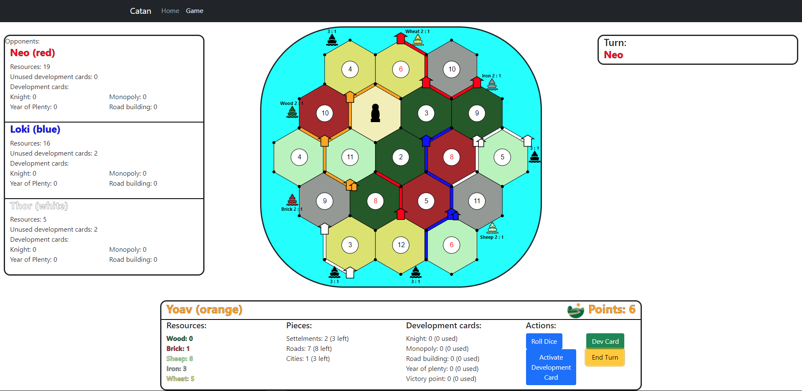

# Catan App (WIP)
## A Web version of the world-famous strategy board game- "Settlers of Catan"

The project contains 3 main parts:
### API Server
A light client facing API server. Manages game lobbies, queues, and in-game chats. Using express and web sockets with socketIO.
### Web App
A real time graphical web application. Build using React.js, with redux as a state manager. Built modulary with small reusable components.
### Game Engine
Node.js object oriented design implementing several objects containing game state and main logic.


##### Notable missing features from current version
- Resource trading
- Road building development card functionallity


- "endTurn" directive- 
    * Will start the turn of the next player
    * After: always
    * Next directive: dice roll / knight activation
    * Example:
    ```
    {
        type: "endTurn",
        player: "blue"
    }
    ```
- "rollDice" directive-
    * rolls the dice at the beginning of a turn.
    * After: turn end, knight activation
    * Next directive: all in-turn directives
    * Example:
    ```
    {
        type: "rollDice",
        player: "blue"
    }
    ```
- "dropResources" directive-
    * After a 7 roll, drops half of the players hand if he had more than 7 resources.
    * After: rollDice (only if rolled 7)
    * Next directive: all in-turn directives once all required players dropped their recources.
    * Example:
    ```
    {
       type: "dropResources",
       player: "blue",
       resources: ["wood","wood","wood","wood"]
    }
    ```
- "build" directive-
    * build a piece on the board (settelment, city, or road).
    * After: dice roll
    * Next directive: any in-turn directive
    * Examples:
    ```
    {
       type: "build",
       player: "blue",
       item: 
           {
               type: "settlement"
               x: 10,
               y: 45,
           }
    }
    ```
    ```
    {
       type: "build",
       player: "blue",
       item: 
           {
               type: "road"
               startX: 10,
               startY: 45,
               endX: 30,
               endY: 45,
           }
       }
    }
    ```
- "buyDevCard" directive-
    * Adds a new development card to a player.
    * After: "rollDice", any in-turn directive.
    * Next directive: any in-turn directive
    * Example: 
    ```
    {
        type: "buyDevCard",
        player: "blue",
    }
    ```
- "activateDevCard" directive-
    * Activates a certien development card.
    * After: any in-turn directive unless- a knight card (can also be used before turn), once a turn, cant use just-built cards unless year of plenty card.
    * Next directive: any in-turn directive
    * Examples: 
    ```
    {
        type "activateDevCard",
        player: "blue",
        card: {
            type: "knight",
            newRobberX: 30,
            newRobberY: 40,
        }
    }
    {
        type "activateDevCard",
        player: "blue",
        card: {
            type: "monopoly",
            resource: "wood",
        }
    }
    {
        type "activateDevCard",
        player: "blue",
        card: {
            type: "yearOfPlenty",
            resourceA: "iron",
            resourceB: "sheep",
        }
    }
    ```
- "tradeWithPort" directive-
    * Instantly trades with a requested port if a player has access to it.
    * After: "diceRoll", any in-turn directive.
    * Next directive: any in-turn directive.
    * Example: 
    ```
    {
        type: "tradeWithPort"
        player: "blue",
        portType: "bank"
        resourceToGive: "wood",
        resourceToTake: "iron",
    }
    ```
- "moveRobber" directive-
    * Moves the robber to a different tile.
    * After: knight activation or a 7 roll.
    * Next directive: any
    * Example:
    ```
    {
        type: "robbPlayer",
        player: "blue",
        newRow: 2,
        newCell: 3,
    }
    ```
- "robbPlayer" directive-
    * Steals a random resource from a selected player.
    * After: "moveRobber"
    * Next directive: any
    * Example:
    ```
    {
        type: "robbPlayer",
        player: "blue",
        playerToRobb: "red",
    }
    ```
- "setupBuild" directive-
    * Builds a settlement or a road in setup mode
    * After: only in setup phase
    * Next directive: "setupBuild" or ending of the setup phase
    * Examples: 
    ```
    {
        type: "setupBuild",
        player: "blue"
        item: {
            name: "settlement"
            x: 10,
            y: 45,
        }
    }
    ```
    ```
    {
        type: "setupBuild",
        player: "blue"
        item: {
            name: "road"
            startX: 10,
            startY: 45,
            endX: 30,
            endY: 45,
        }
    }
    ```


(WIP screenshot)

